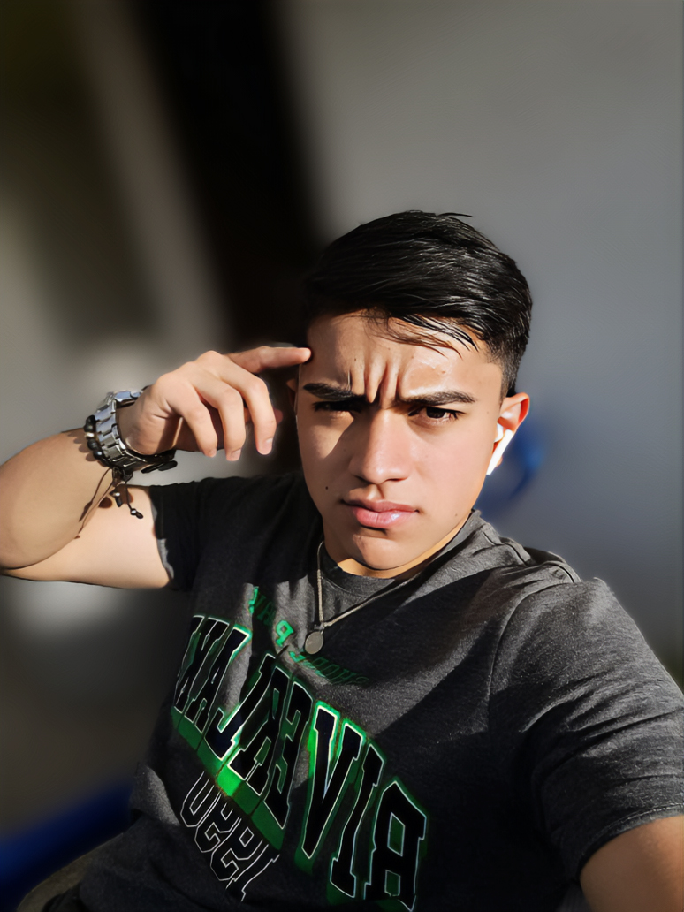

# What is up people ✌️
## Esto es un poco sobre mi:

Mi nombre es *Camilo* **Soy estudiante de ingenieria de software de tercer semestre** y soy de la ciudad de **Pasto-Colombia** , y desde que era muy pequeño me gustaban las computadoras , y casi todo mi entorno familiar estudia o estudio programacion o ingenieria de sistemas.

 #### **Estas son algunas cosas que me gustan hacer en mi dia a dia** :

* Ir a el gym 💪
* Estudiar 📚
    * Todo lo que tiene que ver con programacion🖥️
* leer 📖
* pasar tiempo con mi familia 👨‍👩‍👧‍👦👨‍👩‍👧‍👦
* salir con amig@s 🥳🥳
* Dormir 😴🥱

Por si te quieres pasar por mi GitHub ----> [Arthuroxx.com](https://github.com/Arthuroxx/semana-1.git)

